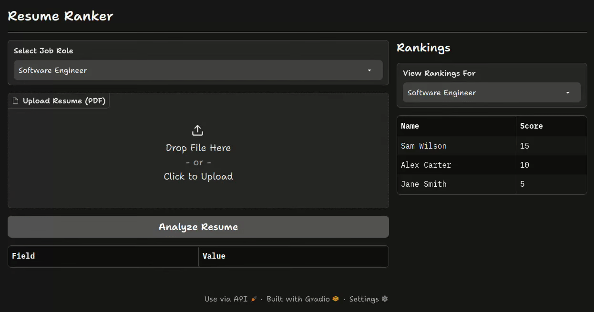

# resume-analyzer
an AI-powered resume ranker that uses LLM and score resumes against specific job roles. built with Gradio, it provides a detailed breakdown of each candidate, including a match score, skill analysis, and suggested interview questions, then displays a ranked leaderboard.

## setup:
```bash
pip install -r requirements.txt #install dependencies
```
```bash
GOOGLE_API_KEY=<api_key> #set env variable
```
```bash
python app.py #run main application
```
```bash
python database/clear_db.py #clear database (optional)
```
## preview:

